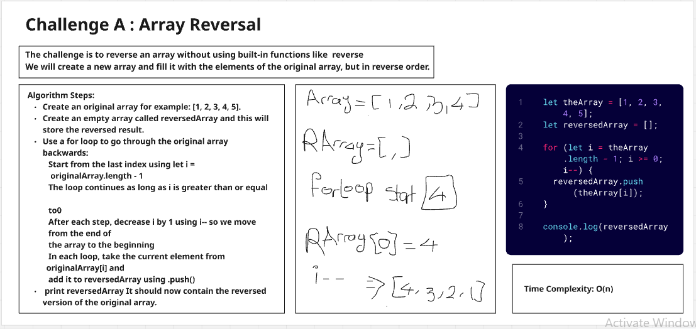
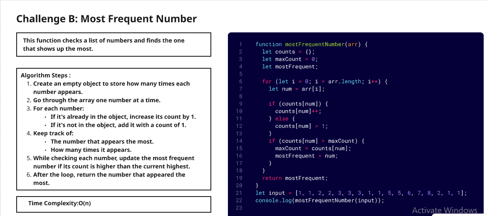
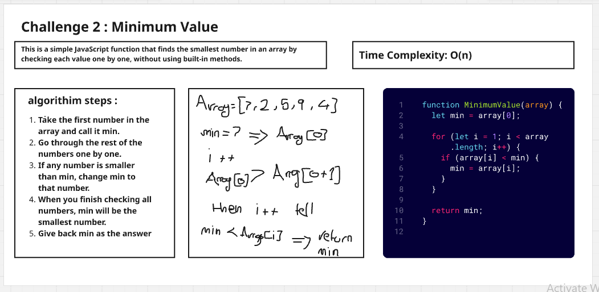
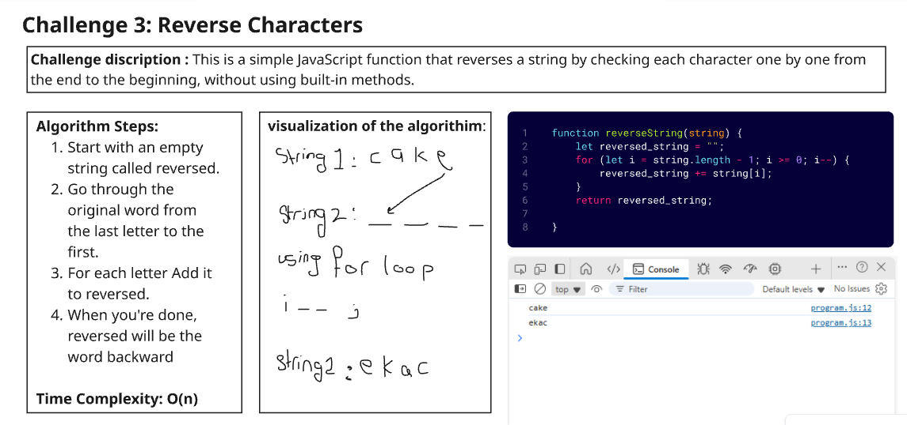
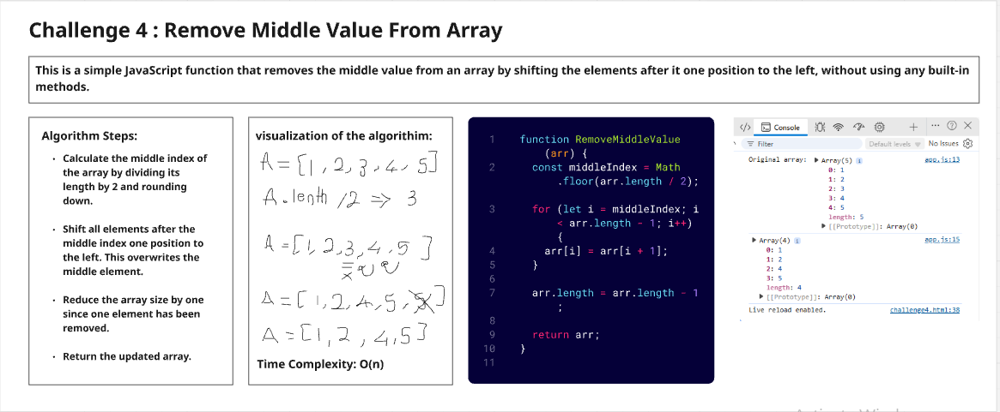

# challenge A : Array Reversal
This is a simple JavaScript code that reverses an array without using built-in functions. 

___
# Challenge B: Most Frequent Number
This is a simple JavaScript code that finds the most frequent number in an array. If there are multiple numbers with the same frequency, it returns the first one that appears.

___
# challenge 2 : Minimum Value
This is a simple JavaScript function that finds the smallest number in an array by checking each value one by one, without using built-in methods

___
# challenge 3 : reverce characters
 This is a simple JavaScript function that reverses a string by checking each character one by one from the end to the beginning, without using built-in methods. 
 
 ___
 # Challenge 4 : Remove Middle Value From Array
 This is a simple JavaScript function that removes the middle value from an array by shifting the elements after it one position to the left, without using any built-in methods.
 
 ___
 # Linked List :
 [the README file for the linked list](/data-structers/linkedlist/README.md)
 ___
# Linked List Reverse :
[the README file for the reversed linked list](/data-structers/linkedlist/reverse/README.md)
___
# Linked List Merge Sorted Lists:
[the README file for the Linked List Merge Sorted Lists](/data-structers/linkedlist/MergeSorted/README.md)
___
# Linked List rotate by K:
[the README file for the Linked List rotate by K](/data-structers/linkedlist/rotatelinkedlist/README.md)

___
# Stack and Queue implementation :
[the README file for the stack and queue](/data-structers/stack&queue/stack&queue_implementation/README.md)
___
# Delete Middle Element of a Stack
[the README file for the Delete Middle Element of a Stack](/data-structers/stack&queue/DeleteMiddelElement/README.md)
___
# Min Stack Challenge
[the README file for the min stack challenge](/data-structers/stack&queue/MinStack/README.md)
___
# Binary Tree and Binary Search Tree Implementation
[the README file for the Binary Tree and Binary Search Tree](/data-structers/trees/README.md)

